# Perspective: Understanding the C++ Memory Model

> This article is adapted from the original internal slides. Core technical content is preserved.
> The structure, wording, and visuals are optimized for GitHub-style learning and sharing.

---

## 1. Introduction

The C++ memory model provides a foundational understanding of how a program’s execution interacts with and utilizes system memory.

**Why this matters**:
- It explains how program data and operations map onto virtual and physical memory.
- It is essential for writing efficient, safe, and maintainable C++ code.
- It directly impacts correctness in dynamic memory management, concurrency, and system-level programming.

---

## 2. Memory Model of a Program’s Lifeline

### 2.1 Overview

#### 2.1.1 Memory Accessibility

- **Byte is the smallest addressable unit**.
- Every byte has a unique address.
- This enables precise read/write operations at exact memory locations.

---

#### 2.1.2 Process Memory Model

Each process has its own **virtual address space**, which is mapped by the OS to physical memory.

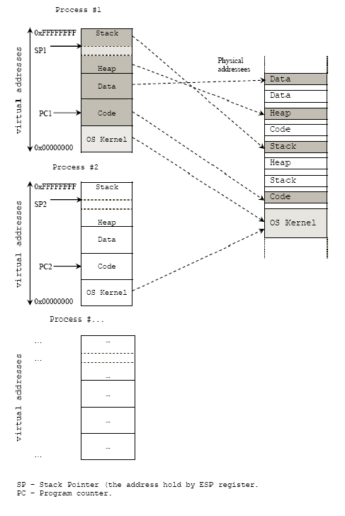

Key points:
- Code, data, heap, and stack live in virtual memory.
- Multiple processes can map to the same physical memory (e.g. shared libraries).

---

#### 2.1.3 Process vs Thread

Threads **share most memory** within a process but have **independent stacks**.

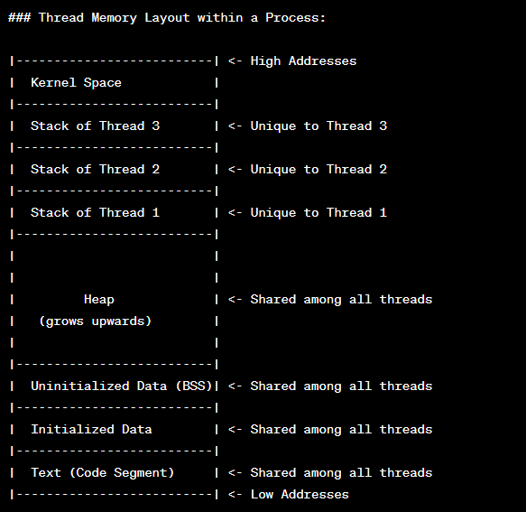

Summary:
- Heap, global data, and code are shared among threads.
- Each thread owns its own stack.

---

#### 2.1.4 Program’s Lifeline

How a C++ program runs from start to end:

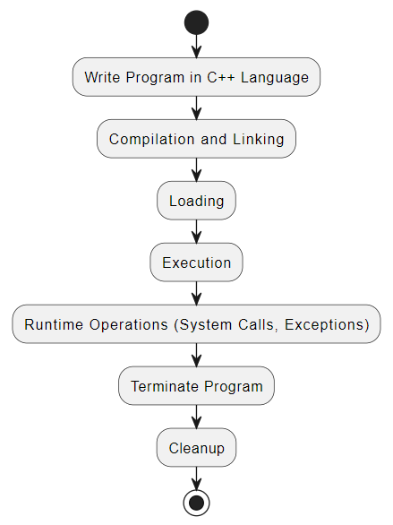

Steps:
1. Compilation & Linking
2. Loading into memory
3. Execution (starting from `main()`)
4. Runtime operations (system calls, exceptions)
5. Termination
6. Cleanup

---

## 2.2 Loading and Memory Allocation

### Loader Responsibilities

- Read executable from disk
- Allocate memory
- Load code and data into RAM

### Memory Segments

- **Text (Code)**: executable instructions
- **Data**: global & static variables
- **Stack**: function calls and local variables
- **Heap**: dynamic memory allocation

---

## 2.3 Stack vs Heap — Deep Comparison

### 2.3.1 Comparison Table

| Dimension | Stack | Heap |
|---|---|---|
| Allocation Speed | Very fast (pointer bump) | Slower (allocator search) |
| Deallocation | Automatic (scope exit) | Manual (`delete`) or smart pointer |
| Size Limit | Small, fixed (typically 1–8 MB) | Limited only by available virtual memory |
| Allocation pattern & fragmentation | Contiguous, no fragmentation | Non-contiguous possible, causes fragmentation over time |
| Thread Safety | Inherently thread-safe (each thread has own stack) | Requires synchronization for shared access |
| Typical Use Cases | Local variables, function parameters, small fixed-size data | Dynamic-size data, objects with lifetime beyond scope, large allocations |

---

### 2.3.2 ASCII Memory Layout Diagram

```
┌─────────────────────────┐ High Address (0xFFFF...)
│         Stack            │ ← grows downward ↓
│  (local vars, frames)    │
├─────────────────────────┤
│           ↓              │
│                          │
│      (free space)        │
│                          │
│           ↑              │
├─────────────────────────┤
│         Heap             │ ← grows upward ↑
│  (dynamic allocation)    │
├─────────────────────────┤
│  BSS (uninitialized)     │
├─────────────────────────┤
│  Data (initialized)      │
├─────────────────────────┤
│  Text (code)             │
└─────────────────────────┘ Low Address (0x0000...)
```

---

### 2.3.3 Code Example

```cpp
#include <memory>

void example() {
    // Stack allocation — fast, automatic cleanup
    int stackVar = 42;              // lives on stack, freed when function returns
    int stackArray[10];             // 10 ints on stack

    // Heap allocation — flexible, manual or smart-pointer cleanup
    int* heapVar = new int(42);     // lives on heap
    delete heapVar;                 // must manually free

    // Modern C++ — prefer smart pointers for heap
    auto ptr = std::make_unique<int>(42);  // heap, auto-freed when ptr goes out of scope
}
// stackVar, stackArray destroyed here (stack unwinding)
// ptr's destructor called here → frees heap memory
```

---

### 2.3.4 Tricky Focus: Stack Overflow

**What causes it**: Stack overflow occurs when the call stack exceeds its allocated size — most commonly due to deep or infinite recursion, or declaring very large local arrays.

```cpp
// Infinite recursion → stack overflow
void recurse() {
    int localArray[1024];  // each frame consumes stack space
    recurse();             // no base case → eventually overflows
}
```

**How to detect and prevent**:
- Use a debugger or sanitizer (e.g., AddressSanitizer) — stack overflows typically manifest as a segmentation fault.
- Add a proper base case to every recursive function.
- Move large arrays/buffers to the heap (`new` or `std::vector`) instead of declaring them as local variables.
- Rewrite deep recursion as an iterative loop when feasible.

**Platform-specific default stack sizes**:
- Linux: ~8 MB (configurable with `ulimit -s`)
- Windows: ~1 MB (configurable in linker settings)

> If large local data is unavoidable, allocate it on the heap to avoid exhausting the stack.

---

## 3. C++ Object-Oriented Memory Layout

### 3.1 Object Memory Model

Different parts of a C++ object live in different memory segments depending on how they are declared and created.
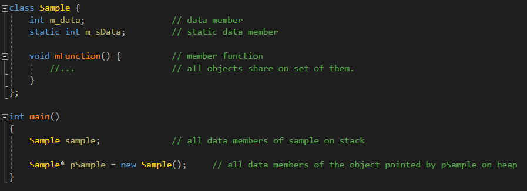
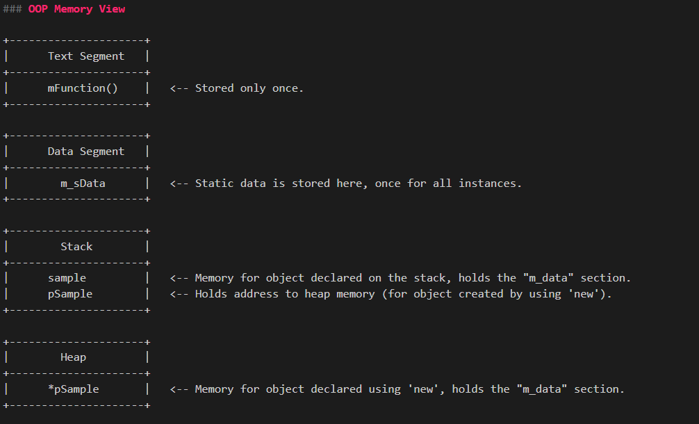

Key observations:
- Member functions live in the text segment.
- Static members live in the data segment.
- Object instances live on stack or heap.

---

### 3.2 Inheritance Memory Model

Derived classes extend base-class memory layout.
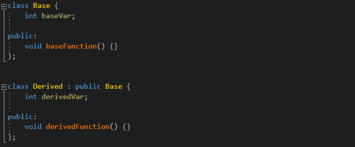
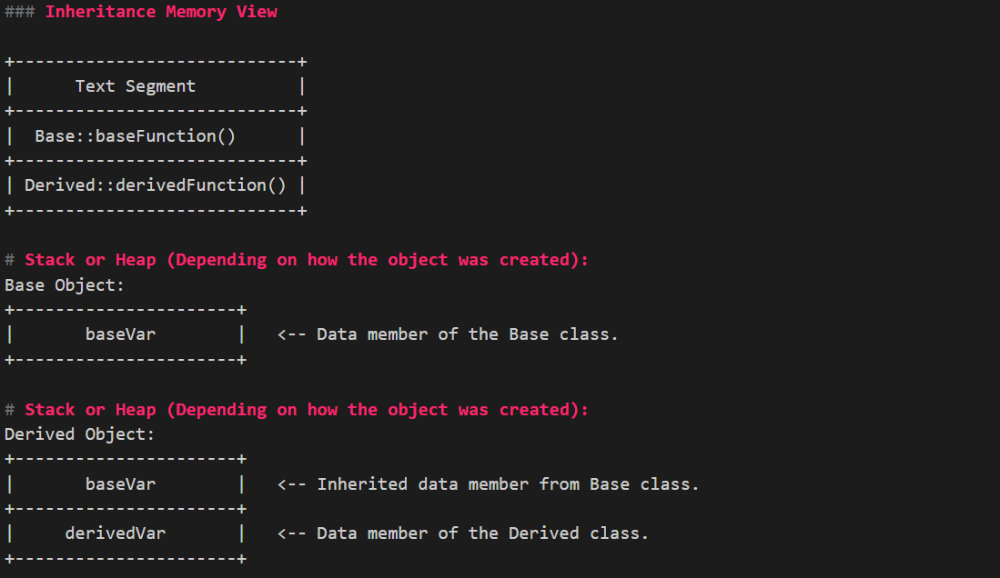

#### Object Slicing

When a derived object is copied into a base object, derived parts are lost.
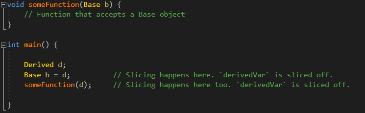
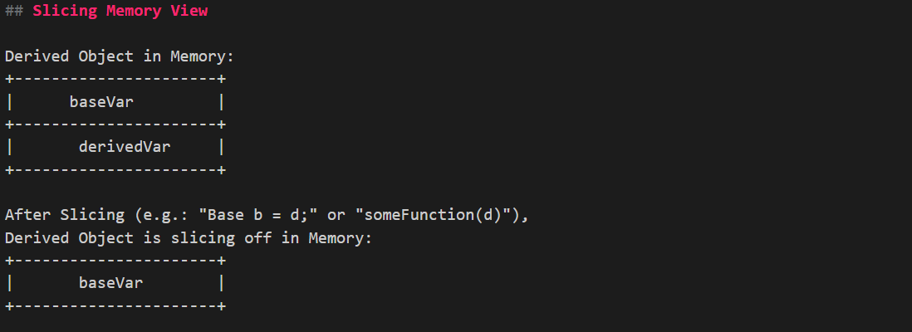

Rule of thumb:
> Pass polymorphic objects by **reference or pointer**, never by value.

---

### 3.3 Virtual Function Memory Model (Polymorphism)

C++ implements polymorphism using **VTables**.
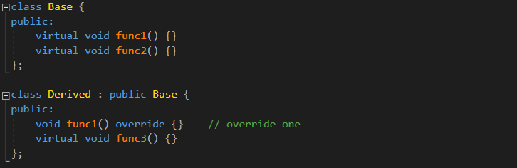
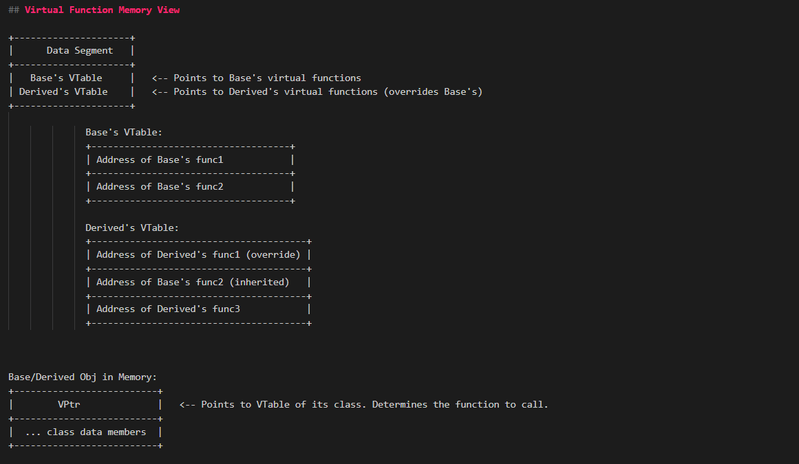

Key ideas:
- Each class with virtual functions has a VTable.
- Each object contains a hidden `vptr` pointing to its class’s VTable.
- Virtual dispatch is resolved at runtime via the VTable.

---

## 4. Smart Pointer Memory Model

Smart pointers manage object lifetime automatically.

---

### 4.1 `unique_ptr`

- Exclusive ownership
- Zero overhead abstraction

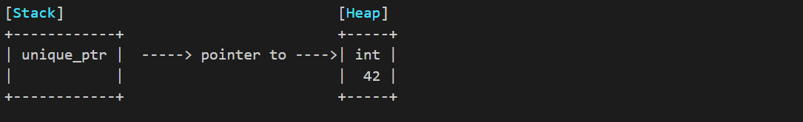

When the `unique_ptr` goes out of scope, the object is destroyed automatically.

---

### 4.2 `shared_ptr`

- Shared ownership
- Reference counting via control block

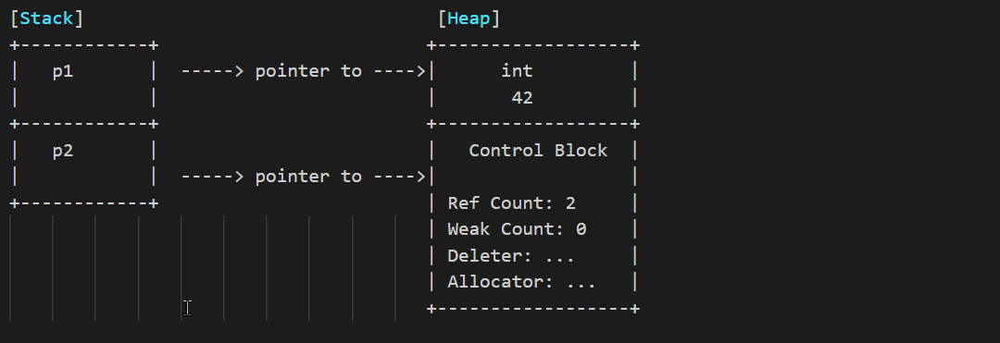

Important:
- Object is destroyed when **reference count reaches zero**.
- Control block may outlive the object.

---

### 4.3 `weak_ptr`

- Non-owning observer of a `shared_ptr`
- Breaks reference cycles

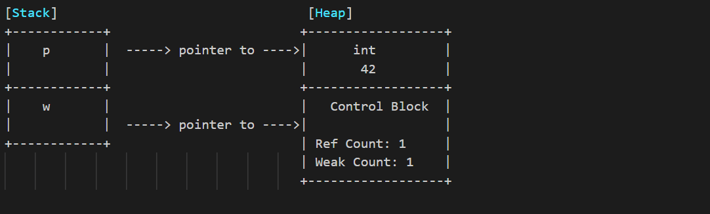

Rule:
> Use `weak_ptr` to observe, not to own.

---

### 4.3.1 Lifecycle: From Creation to Complete Release

```
Stage 1: shared_ptr created
  strong_count=1, weak_count=0
  [ Object ✓ | Control Block ✓ ]

Stage 2: weak_ptr created from shared_ptr
  strong_count=1, weak_count=1
  [ Object ✓ | Control Block ✓ ]

Stage 3: Last shared_ptr destroyed (strong_count → 0)
  strong_count=0, weak_count=1
  [ Object ✗ (destroyed!) | Control Block ✓ (kept alive for weak_ptr) ]

Stage 4: Last weak_ptr destroyed (weak_count → 0)
  strong_count=0, weak_count=0
  [ Object ✗ | Control Block ✗ (both freed) ]
```

---

### 4.3.2 Complete Lifecycle Code Example

```cpp
#include <iostream>
#include <memory>

void weak_ptr_lifecycle() {
    std::weak_ptr<int> wp;

    {
        auto sp = std::make_shared<int>(42);  // strong=1, weak=0
        wp = sp;                               // strong=1, weak=1

        // lock() creates a temporary shared_ptr
        if (auto locked = wp.lock()) {
            std::cout << "Value: " << *locked << "\n";  // strong=2 temporarily
        }  // locked destroyed → strong=1

        std::cout << "expired? " << wp.expired() << "\n";  // false
    }  // sp destroyed → strong=0 → object destroyed, weak=1 → control block alive

    std::cout << "expired? " << wp.expired() << "\n";  // true
    auto locked = wp.lock();  // returns nullptr
}  // wp destroyed → weak=0 → control block freed
```

---

### 4.3.3 `make_shared` vs `new` + `shared_ptr` — Control Block Memory Insight

| | Memory Layout | Freed When |
|---|---|---|
| `make_shared<T>()` | Single allocation: object + control block are contiguous | Both freed together when `weak_count` reaches 0 |
| `new T()` + `shared_ptr` | Two allocations: object and control block are separate | Object freed when `strong_count=0`; control block freed when `weak_count=0` |

```
make_shared:       [ Control Block | Object ]  ← single allocation, freed together

new + shared_ptr:  [ Control Block ] → [ Object ]  ← two allocations, freed independently
```

> **Note**: With `make_shared`, even after all `shared_ptr`s are gone and the object is logically destroyed, the *memory* cannot be reclaimed until every `weak_ptr` is also destroyed. This is a classic senior-level / FAANG follow-up question.

---

### 4.3.4 Breaking Circular References — Example

```cpp
#include <iostream>
#include <memory>

struct Node {
    std::shared_ptr<Node> next;  // strong reference → circular!
    ~Node() { std::cout << "Node destroyed\n"; }
};

void circular_leak() {
    auto a = std::make_shared<Node>();
    auto b = std::make_shared<Node>();
    a->next = b;
    b->next = a;  // circular reference! Neither will be destroyed
}

// Fix: use weak_ptr for back-references
struct SafeNode {
    std::shared_ptr<SafeNode> next;
    std::weak_ptr<SafeNode> prev;  // weak reference → breaks cycle
    ~SafeNode() { std::cout << "SafeNode destroyed\n"; }
};

void no_leak() {
    auto a = std::make_shared<SafeNode>();
    auto b = std::make_shared<SafeNode>();
    a->next = b;
    b->prev = a;  // weak_ptr → no circular ownership
}  // Both SafeNodes destroyed correctly ✓
```

---

## Final Notes

This memory perspective helps:
- Debug memory issues faster
- Design safer APIs
- Reason correctly about object lifetime
- Avoid common pitfalls in modern C++

If you truly understand **where things live**, you write better C++.

---

Happy hacking 🚀

