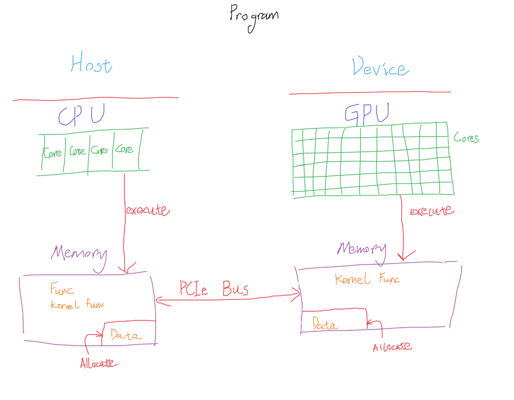

# Using CUDA (GPU) to Compute

> GitHub-ready Markdown version converted from your original CUDA basics PDF notes.  
> **Note:** Diagrams/handwritten sketches from the original PDF are inserted **inline** below the corresponding sections (original extracted images, unchanged).

---

## Table of Contents

- [1. Getting Started with CUDA](#1-getting-started-with-cuda)
  - [1.1 Introduction](#11-introduction)
  - [1.2 Understand How to Write and Run a CUDA Program](#12-understand-how-to-write-and-run-a-cuda-program)
  - [1.3 CPU vs GPU Architecture](#13-cpu-vs-gpu-architecture)
  - [1.4 Some Key Abstractions in CUDA](#14-some-key-abstractions-in-cuda)
- [2. CUDA Models: Programming → Execution → Memory Model](#2-cuda-models-programming--execution--memory-model)
  - [2.1 Programming Model](#21-programming-model)
  - [2.2 Execution Model](#22-execution-model)
  - [2.3 Memory Model](#23-memory-model)
- [3. CUDA Core Techniques (Round 2)](#3-cuda-core-techniques-round-2)
  - [3.1 Thread Organization](#31-thread-organization)
  - [3.2 Memory Usage](#32-memory-usage)
  - [3.3 Synchronization and Data Race](#33-synchronization-and-data-race)
  - [3.4 Code-induced Execution Performance Considerations](#34-code-induced-execution-performance-considerations)
- [4. CUDA Advanced Usage & Restrictions (Round 3)](#4-cuda-advanced-usage--restrictions-round-3)
- [5. Performance Testing & Debugging References](#5-performance-testing--debugging-references)
- [6. Reference](#6-reference)

---

## 1. Getting Started with CUDA

### 1.1 Introduction

GPU computing has become a powerful tool in many areas. NVIDIA's CUDA (**Compute Unified Device Architecture**) offers developers a set of interfaces to perform general-purpose computing (GPGPU) on GPUs, so we can leverage the GPU's parallel power for numerical computing, big data, and AI.

**Who is this for**
- Developers familiar with C/C++ and interested in GPU programming who want to quickly get started with CUDA.

**Goals**
- Understand the basic concepts of GPU parallel computing.
- Lay the groundwork for deeper topics such as programming/execution/memory models and performance optimization.

---

### 1.2 Understand How to Write and Run a CUDA Program

In CUDA, your program runs on two main hardware sides:

- **Host**: CPU + host memory (system RAM), running standard C/C++ code
- **Device**: GPU + device memory (VRAM), executing CUDA kernels in parallel on many threads

The core ideas of writing a CUDA program are:

**Original PDF sketch (Host ↔ Device overview)**



1. Host-side (CPU) code allocates memory and issues commands to the device (GPU).
2. Prepare input data on the host and transfer it to device (GPU) memory.
3. Launch a **kernel function** (a C/C++ function executed on the GPU) to run in parallel.
4. After processing, copy results back from the device to the host.

#### Example

```cpp
#include <cuda_runtime.h>
#include <stdio.h>

// Kernel function (runs on the GPU)
__global__ void vectorAdd(const float* A, const float* B, float* C, int N)
{
    int idx = blockIdx.x * blockDim.x + threadIdx.x;
    if (idx < N) {
        C[idx] = A[idx] + B[idx];
    }
}

int main()
{
    int N = 1000;
    size_t size = N * sizeof(float);

    // 1. Allocate and initialize host memory
    float* h_A = (float*)malloc(size);
    float* h_B = (float*)malloc(size);
    float* h_C = (float*)malloc(size);

    for (int i = 0; i < N; ++i) {
        h_A[i] = i * 1.0f;
        h_B[i] = i * 2.0f;
    }

    // 2. Allocate device memory
    float *d_A, *d_B, *d_C;
    cudaMalloc((void**)&d_A, size);
    cudaMalloc((void**)&d_B, size);
    cudaMalloc((void**)&d_C, size);

    // 3. Copy data from host to device
    cudaMemcpy(d_A, h_A, size, cudaMemcpyHostToDevice);
    cudaMemcpy(d_B, h_B, size, cudaMemcpyHostToDevice);

    // 4. Configure grid/block and launch the kernel
    int blockSize = 256;
    int gridSize = (N + blockSize - 1) / blockSize;

    vectorAdd<<<gridSize, blockSize>>>(d_A, d_B, d_C, N);

    // 5. Synchronize
    cudaDeviceSynchronize();

    // 6. Copy results back to host
    cudaMemcpy(h_C, d_C, size, cudaMemcpyDeviceToHost);

    // Verify results
    bool success = true;
    for (int i = 0; i < N; ++i) {
        if (h_C[i] != h_A[i] + h_B[i]) {
            printf("Error at index %d: %f != %f\n", i, h_C[i], h_A[i] + h_B[i]);
            success = false;
            break;
        }
    }

    if (success) {
        printf("CUDA vectorAdd completed successfully.\n");
    }

    // 7. Free memory
    free(h_A); free(h_B); free(h_C);
    cudaFree(d_A); cudaFree(d_B); cudaFree(d_C);

    return 0;
}
```

---

### 1.3 CPU vs GPU Architecture

**Original PDF figures (CPU vs GPU architecture)**


- **SM (Streaming Multiprocessor)**: Similar (conceptually) to a CPU core cluster for CUDA execution. It is responsible for managing and executing thread blocks.
- A GPU typically has many SMs.
- Each SM has fixed resources such as:
  - registers
  - shared memory
  - schedulers
- SMs execute thread blocks in **warps** (groups of 32 threads).

---

### 1.4 Some Key Abstractions in CUDA

(See the table in Section 2.1.2 / summary table below for a compact view of the main abstractions.)

---

## 2. CUDA Models: Programming → Execution → Memory Model

### 2.1 Programming Model

#### 2.1.1 Why?

GPUs have more and larger parallel units on hardware (hundreds to thousands of computing cores) than traditional CPUs.

So, a specialized programming model is required to harness the GPU’s massive parallel capability. NVIDIA CUDA provides one such set of models and tools to break down problems into small tasks and map them onto the GPU for parallel execution.

The CUDA Programming Model uses a **hierarchical approach**, dividing computations into **Grids**, **Blocks**, and **Threads**, making it easier to logically organize and manage a large number of concurrent threads.

> Imagine managing thousands of threads using the same style as CPU programming—would it be easy?

---

#### 2.1.2 Hierarchical Parallelism

- **Grid**: The entire collection of threads launched by a single kernel invocation.
- **Block**: A subset of threads inside a grid. Threads in the same block can share certain resources (e.g., shared memory) and can synchronize with each other.
- **Thread**: The smallest unit of execution. Each thread runs the same kernel code but typically processes a different portion of the data (using an index like `threadIdx`).

These three levels are the most fundamental units in CUDA, allowing developers to specify:
- how many threads to launch
- how they are grouped into blocks
- how to structure parallel computation tasks

#### Summary Table of CUDA Abstractions

| Category | Abstraction | Definition |
|---|---|---|
| Programming Model | Thread | The smallest unit of execution in CUDA. Each thread runs the same kernel code but operates on different data. |
| Programming Model | Block | A group of threads; threads within it can share shared memory. |
| Programming Model | Grid | A group of blocks launched together to execute a kernel; represents all threads for a kernel call. |
| Programming Model | Kernel | Function (executed by many threads, with different data) that runs on GPU. |
| Programming Model | Synchronization | Mechanisms to coordinate thread execution to ensure data consistency and correct program flow. |
| Programming Model | Streams | Sequences of operations executed in order on the GPU; allow overlapping data transfer and kernel execution. |
| Programming Model | Events | Markers used to synchronize streams and measure performance. |
| Execution Model | SIMT | Single Instruction, Multiple Threads. Multiple threads execute the same instruction on different data. |
| Execution Model | Warp | The smallest scheduling unit; a group of 32 threads executed together by the GPU. |
| Execution Model | Streaming Multiprocessors (SMs) | The core units in a CUDA GPU, each containing multiple CUDA cores, shared memory, and other resources. |
| Execution Model | Schedulers | Hardware units within SMs that manage warps, selecting which warp to execute next to optimize utilization and hide latency. |
| Execution Model | Thread Divergence | When threads within the same warp follow different execution paths, causing the warp to execute multiple instruction streams. |
| Memory Model | Global Memory | Largest and slowest memory; accessible by all threads. |
| Memory Model | Shared Memory | Medium size; faster than global memory and slower than registers; shared among threads in a block. |
| Memory Model | Registers | Smallest and fastest storage; private to each thread for variables and intermediate results. |
| Memory Model | Local Memory | Spill storage when registers are insufficient; physically in global memory but used like per-thread local storage. |
| Memory Model | Constant Memory | Read-only memory optimized for broadcast; useful for storing constants. |

> **Figure note (original PDF):** Page 3 includes a table image showing the same abstractions and definitions, plus a formatted layout of this section.

---

### 2.2 Execution Model

#### 2.2.1 SIMT: Single-Instruction, Multiple-Thread

##### What is SIMT?

SIMT is a parallel execution model where one instruction is shared across multiple threads to process multiple data elements simultaneously.

At the hardware level, NVIDIA GPUs group threads into **warps** (typically 32 threads each). A warp is the lower-level hardware scheduling unit.

- **Warp**: A group of 32 threads that the GPU schedules to execute the same instruction simultaneously.
- When a block is assigned to a **Streaming Multiprocessor (SM)**, it is subdivided into several warps.
- You usually do not directly manage warps in code, but understanding warps helps with performance optimization (especially to avoid warp divergence).

> A warp is basically 32 threads that must execute together.

> **Figure note (original PDF):** Page 4 includes:
> - Grid/Block/Thread hierarchy diagrams
> - A software-to-hardware mapping diagram (Thread → Warp → SM → GPU)
> - Hand-drawn SIMT and warp sketches

**Original PDF figures (SIMT / hierarchy / mapping)**


---

#### 2.2.2 Warp Scheduling

A GPU often contains multiple SMs. Each SM can hold multiple blocks, and each block is further split into several warps.

The warp scheduler picks a “ready-to-run” warp to dispatch instructions. If a warp must wait (for memory or synchronization), the scheduler can switch to another warp and hide latency.

Key points:

- **Zero-overhead thread switching**: GPU can quickly switch among warps, so one stalled warp does not waste compute resources.
- **Branch Divergence**: If some threads in a warp take the `if` branch and others take the `else` branch, the warp executes both paths in sequence, reducing efficiency.

So, it is better when threads in the same warp follow the same execution path whenever possible.

**Original PDF figure (warp divergence example)**


---

### 2.3 Memory Model

#### 2.3.1 Why Do We Need a Multi-Level Memory Hierarchy?

During kernel execution, data access patterns heavily impact performance.

For example:
- **Global Memory** (GPU VRAM) has relatively high latency
- **Shared Memory** (on-chip) is much faster but only visible to threads within the same block

This leads to a core CUDA concept: **hierarchical storage**.

Based on access speed and visibility scope, main categories are:

1. **Global Memory**
   - Accessible by all threads
   - Large capacity (hundreds of MB to several GB)
   - High latency
   - Requires **coalesced access** (adjacent threads access adjacent addresses) for best bandwidth utilization

2. **Shared Memory**
   - Visible only within a block
   - Much faster than global memory (like an on-chip cache for an SM)
   - Good for data reused by threads in the same block
   - Limited capacity (typically tens to around a hundred KB per SM, depending on architecture)

3. **Local Memory**
   - Used when registers are insufficient
   - Actually located in global memory
   - Performance is similar to global memory (so it is not truly “local” in speed)

4. **Registers**
   - Private to each thread
   - Extremely low access latency
   - Limited quantity; overuse may spill into local memory and hurt performance

5. **Constant & Texture Memory**
   - Stored in GPU memory but with special caching mechanisms
   - Good for frequently read, rarely modified data (constants, textures)
   - Can improve performance for read-only access patterns

> **Figure note (original PDF):** Page 5 shows a memory hierarchy diagram with Blocks, Threads, Registers, Local, Shared, Global, Constant, Texture, and Host (CPU).

**Original PDF figure (CUDA memory hierarchy)**


---

#### 2.3.2 Coalesced Access & Bank Conflict

##### Coalesced Access (Global Memory)

CUDA encourages **adjacent threads accessing adjacent memory addresses** (coalesced access).

If access is not coalesced, the GPU may need more memory transactions, which reduces throughput.

In the `vectorAdd` example above:

**Original PDF examples (global memory coalesced access)**


- `idx` is consecutive
- Threads in the same warp read/write consecutive memory
- This allows memory requests to be coalesced into fewer transactions

For 2D/3D arrays:
- Be careful with layout (row-major / column-major)
- Make thread `(x, y)` indexing map to memory as linearly as possible

##### Bank Conflict (Shared Memory)

To support parallel shared-memory access inside a block, the GPU divides shared memory into multiple **banks**.

If multiple threads access different addresses that map to the same bank, the accesses may be serialized. This is called a **Bank Conflict**, and it lowers performance.

**Original PDF figure (shared memory bank mapping)**


---

## 3. CUDA Core Techniques (Round 2)

> **Original note:** “Will be introduced in Round 2”

To implement high-quality and high-performance CUDA code, we need a solid foundation in:
- thread organization
- execution behavior (CUDA handles many details, but understanding it still matters)
- memory model
- synchronization and data race handling

These techniques are the **means**, while fast execution and good code quality are the **ends**.

---

### 3.1 Thread Organization

#### 3.1.1 Significance of Thread Organization

A good thread organization helps in several ways:

- **Maximize Parallelism**  
  A good thread mapping fully leverages the GPU’s parallel capability. By choosing proper grid/block dimensions (1D/2D/3D), the GPU can keep more threads active.

- **Improve Readability & Maintainability**  
  Matching thread organization to data shape makes code more intuitive:
  - 1D data → 1D grid / 1D blocks
  - 2D data → 2D grid / 2D blocks
  - 3D data → 3D grid / 3D blocks

- **Prevent Out-of-Bounds Access**  
  Organizing threads well + doing boundary checks reduces illegal memory operations and improves correctness/debugging.

---

#### 3.1.2 How to Organize Indices of Thread

Checklist / key ideas:
- Match data dimensions
- Prefer 32x-aligned thread counts (warp-friendly)
- Compute global indices in a unified manner
- Check boundaries
- Aim for coalesced global memory access
- Avoid bank conflicts in shared memory

---

### 3.2 Memory Usage

**Original PDF example (constant memory)**


- Global Memory
- Shared Memory
- Constant Memory
- Register Memory

> Typically, we cannot directly control registers, and it is usually not a good idea to over-focus on manual register control early.

---

### 3.3 Synchronization and Data Race

In a parallel computing environment, threads run concurrently and often share resources. This can lead to race conditions if not handled carefully.

Proper synchronization ensures operations on shared data occur in a predictable and correct order.

**Original PDF example (shared memory + __syncthreads)**


---

#### 3.3.1 Why/When to Use Synchronization?

- **Correctness in Parallel Operations**  
  Without synchronization, multiple threads may read/write the same memory location at overlapping times, causing inconsistent results (data races).

- **Coordinating Shared Memory Access**  
  Threads in the same block often use shared memory. Synchronization is required when one group writes data that another group reads.

- **Maintaining Program Flow**  
  Even without direct data dependencies, synchronization may be needed in multi-phase algorithms (e.g., tiled matrix multiplication).

- **Performance Trade-offs**  
  Synchronization adds overhead. Use it only where needed for correctness or clear data dependencies.

---

#### 3.3.2 Block-Level vs. Global Synchronization

CUDA offers multiple synchronization levels:

1. **Block-Level (Intra-Block) Synchronization**
   - `__syncthreads()`: barrier inside a kernel
   - Ensures all threads in the same block reach that point before any continue
   - Scope: one block only (other blocks do not wait)

2. **Grid-/Device-Level (Inter-Block) Synchronization**
   - CUDA does **not** provide a built-in all-block barrier inside a normal kernel
   - Common approach: split computation into multiple kernel launches
   - When one kernel finishes, all blocks in that kernel are complete
   - `cudaDeviceSynchronize()` makes the CPU wait until all previously launched GPU work is done

3. **Stream Synchronization**
   - For advanced control, CUDA streams can overlap kernels and memory transfers
   - `cudaStreamSynchronize(stream)` waits only for a specific stream
   - This can improve performance by overlapping compute and communication

---

#### 3.3.3 Potential Data Races and How to Address Them

A data race occurs when:
- multiple threads access the same memory location
- without proper ordering/synchronization
- and at least one thread writes

Common CUDA data race scenarios:

1. **Shared Memory Updates**
   - Multiple threads in the same block update shared memory without synchronization

2. **Atomic Operations Needed**
   - Multiple blocks update global counters/accumulators
   - Without atomics, data races happen

3. **Warp Divergence + Shared Access**
   - Threads in the same warp take different paths but still touch shared resources

How to address them:

- **Intra-Block Sync**
  - Use `__syncthreads()` when all threads in a block must complete writes before reads happen

- **Atomic Instructions**
  - Use `atomicAdd`, `atomicMin`, etc., for concurrent updates to shared/global accumulators

- **Kernel Splitting**
  - Split the algorithm into multiple kernels if one phase must finish globally before the next starts

- **Race Checking Tools**
  - Use tools like `cuda-memcheck` or Nsight to detect race conditions and memory issues

---

### 3.4 Code-induced Execution Performance Considerations

#### Strategy for Writing Good CUDA Code

1. Define the function calls  
   - Decide how many times the function should run
   - Decide whether to split work into smaller kernels

2. Allocate memory  
   - Allocate input/output memory on host (CPU) and device (GPU)

3. Block and grid allocation  
   - Choose a proper grid/block configuration for your data size and thread architecture

4. Synchronize during result aggregation  
   - Synchronize before reading/updating shared results to avoid races

5. Copy results back to host  
   - Copy final results to host after kernel execution

---

#### Bad Practices That May Lead to Poor CUDA Performance

- **Warp Divergence**  
  When threads within the same warp (32 threads) take different branches — some go into the `if` path A while others go into the `else` path B — the hardware must execute path A first, then path B (or vice versa). This is called warp divergence, and it reduces parallel efficiency.

**Original PDF code example**


- **Uneven Thread Workload / Inconsistent Loop Iterations / Idle Threads**  
  When threads have different workloads or loop iteration counts, some threads finish early while others in the same warp are still running. This causes idle threads to stall and wait, reducing overall efficiency.

**Original PDF code example**


- **Non-Coalesced Global Memory Access**  
  When global memory accesses are not contiguous, the hardware cannot efficiently coalesce read/write transactions, leading to reduced memory bandwidth utilization.

**Original PDF code example**


- **Atomic Contention**  
  When multiple threads compete for atomic operations on the same address, the operations are serialized. The higher the contention, the longer the wait, and the worse the performance.

**Original PDF code example**


- **Shared Memory Bank Conflict**  
  Shared memory is divided into multiple banks. If multiple threads simultaneously access addresses that map to the same bank (and it is not a broadcast), the accesses are serialized, reducing throughput.

**Original PDF code example**


- **Independence Limitation Between Thread Blocks**  
  There is no direct synchronization mechanism between different thread blocks (unless using global memory with external coordination). This design ensures parallelism but also introduces programming constraints.

---

## 4. CUDA Advanced Usage & Restrictions (Round 3)

> To be continued — topics planned: Dynamic Parallelism, CUDA Streams & Concurrency, Unified Memory, Multi-GPU Programming, kernel launch overhead considerations.

---

## 5. Performance Testing & Debugging References

> To be continued — topics planned: Nsight Compute profiling workflow, `cuda-memcheck` / `compute-sanitizer` usage, occupancy analysis, roofline model basics.

---

## 6. Reference

- Nsight Compute — *Nsight Compute Documentation* (version reference in original note: 12.6)
- NVIDIA Nsight Visual Studio Edition — *Nsight Visual Studio Edition Documentation* (version reference in original note: 12.6)
- **CUDA C++ Programming Guide**
